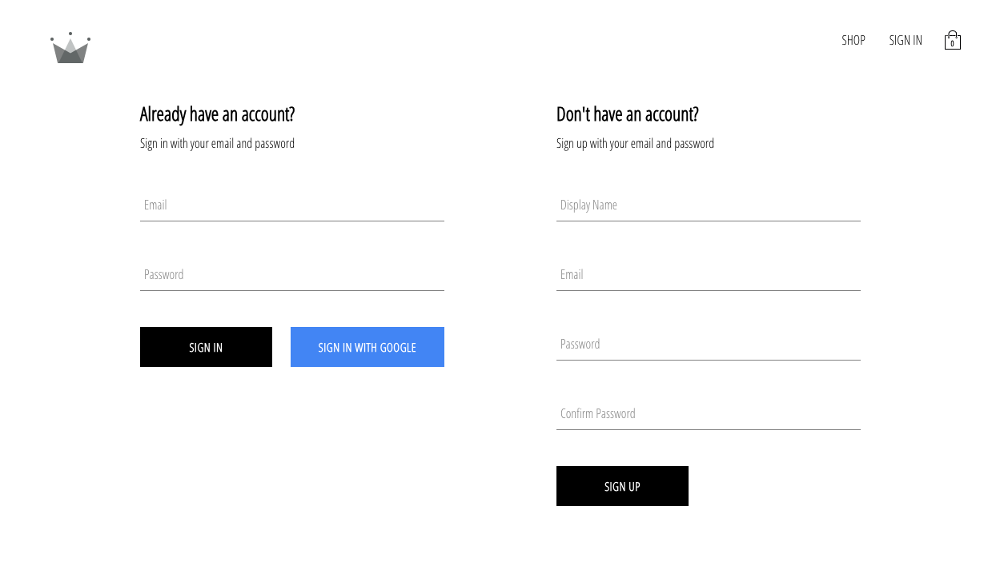
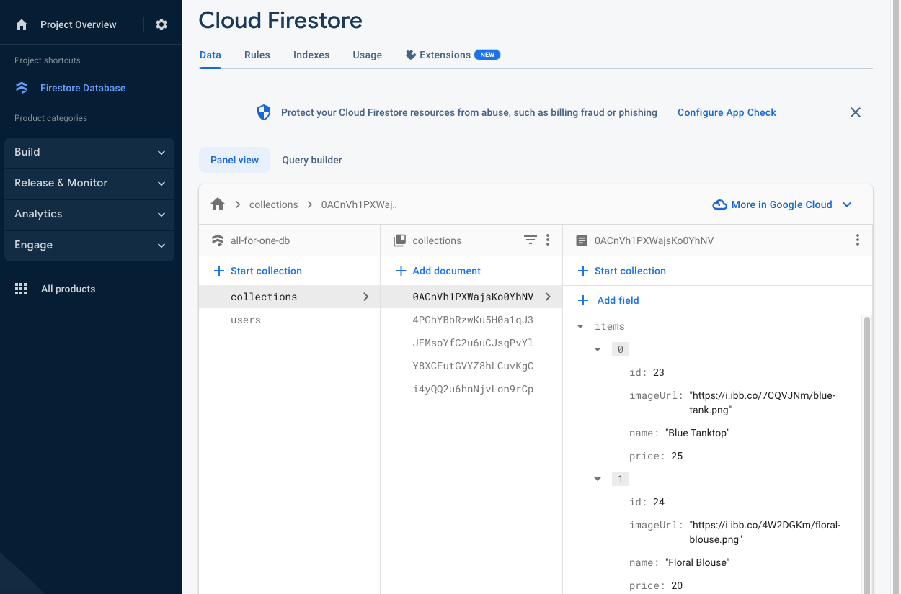
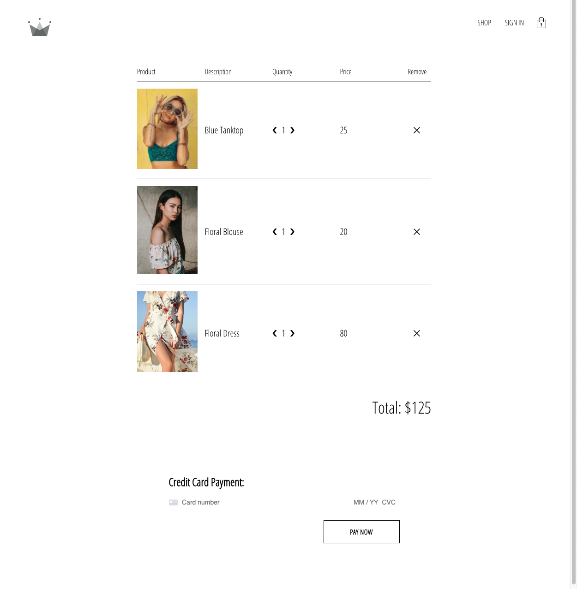
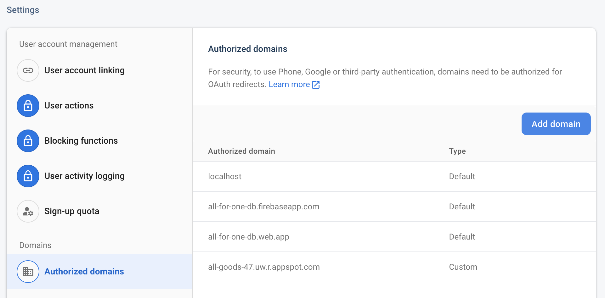

# All Goods (Version 2)

This is a full-stack e-commerse platform which was designed for small businesses.

## Tech Stack

- React.js
- Redux
- Firebase (Authentication, Firestore, Storage)
- Node.js
- Stripe API

## Iteration 1

- Migrated codebase from version 1 (https://github.com/boyangx98/all-goods)
- Verified firestore connection and updated firebase configs
- Added checkout page without payment system integration
- Deployed to Google Cloud App Engine (Deployment link: https://all-goods-47.uw.r.appspot.com/)
- Tagged as `v2.0.0`

## Iteration 2

- Added more features to the checkout page including modifying cart items
- Added category highlight page
- Added gcd deployment domain to auth whitelist
- Removed access to the payment button due to stripe api key security concerns
- Tagged as `v2.0.1`

## Iteration 3

- Added test cases for redux actions, reducers, and firebase utils
- Performed functional testings of all paths in the web app
- Tagged as `v2.0.2`

### Clarifications

- create-payment-intent is not a firebase function, it is a cloud function that is deployed to netlify to handle stripe payment API requests
- Backend database is firebase firestore
